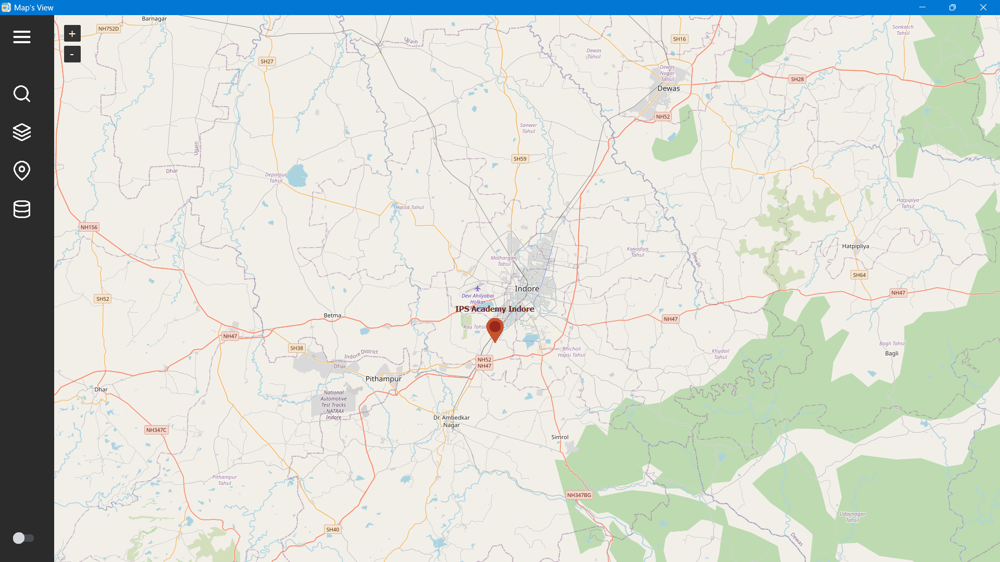
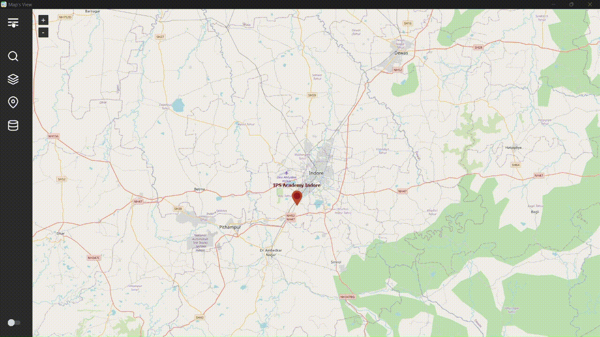

# Map's View

Map's View is a versatile Python application designed to help users explore geographical data interactively. With its intuitive user interface and comprehensive feature set, Map's View is an ideal tool for visualizing and analyzing spatial information.

---



## Features

- **Multi-layered Map Display:** Map's View provides a dynamic map display with support for multiple layers. You can overlay different map types and toggle between them to gain different perspectives on your data.

- **Zoom and Pan Controls:** Effortlessly navigate through the map using standard controls for zooming in and out and panning across different regions. This allows for detailed exploration of specific areas of interest.

- **Search Functionality:** Easily search for places by name, address, or coordinates. Map's View leverages powerful search algorithms to quickly locate specific locations on the map.

- **Marker Placement:** Add markers to the map to mark important points or points of interest. This feature is particularly useful for annotating specific locations and making them stand out on the map.

- **Layer Styles:** Customize the appearance of map layers with different styles and color schemes. Tailor the visualization to suit your preferences or specific requirements.

- **Offline Maps:** Map's View supports offline maps, allowing you to work with geographical data even when you don't have an internet connection. This feature ensures that you can access and analyze your data regardless of your location.

---



## Installation

To install Map's View, follow these steps:

1. Clone the repository: `git clone https://github.com/EnthusiasticXcoder/Maps-View.git`
2. Navigate to the project directory: `cd Maps-View`
3. Install the required dependencies: `pip install -r requirements.txt`

## Usage

To run Map's View, execute the following command:

```shell
python main.py
```

Upon launching the application, you will be greeted with the interactive map interface. Use the provided controls and features to explore and analyze your geographical data.

## Examples

Here are a few code snippets that demonstrate the usage of specific features in Map's View:

#### 1. Searching in the map:

https://github.com/EnthusiasticXcoder/Attendence-Management-Software/assets/115250815/d048f1ae-600a-43c4-82cc-d277eb95aa4c

---

#### 2. Changing the layer style:

https://github.com/EnthusiasticXcoder/Maps-View/assets/115250815/e8510fbe-f655-43cf-99f2-1c74699e01b5

---

#### 3. Adding a marker to the map:

https://github.com/EnthusiasticXcoder/Maps-View/assets/115250815/ef84325b-1db7-488f-b289-1d15c9d9ba31


Feel free to explore the codebase and experiment with different functionalities to make the most out of Map's View.

## Contributing

Contributions are welcome! If you have any ideas, suggestions, or bug reports, please create an issue or submit a pull request.

## License

Map's View is licensed under the [MIT License](LICENSE).